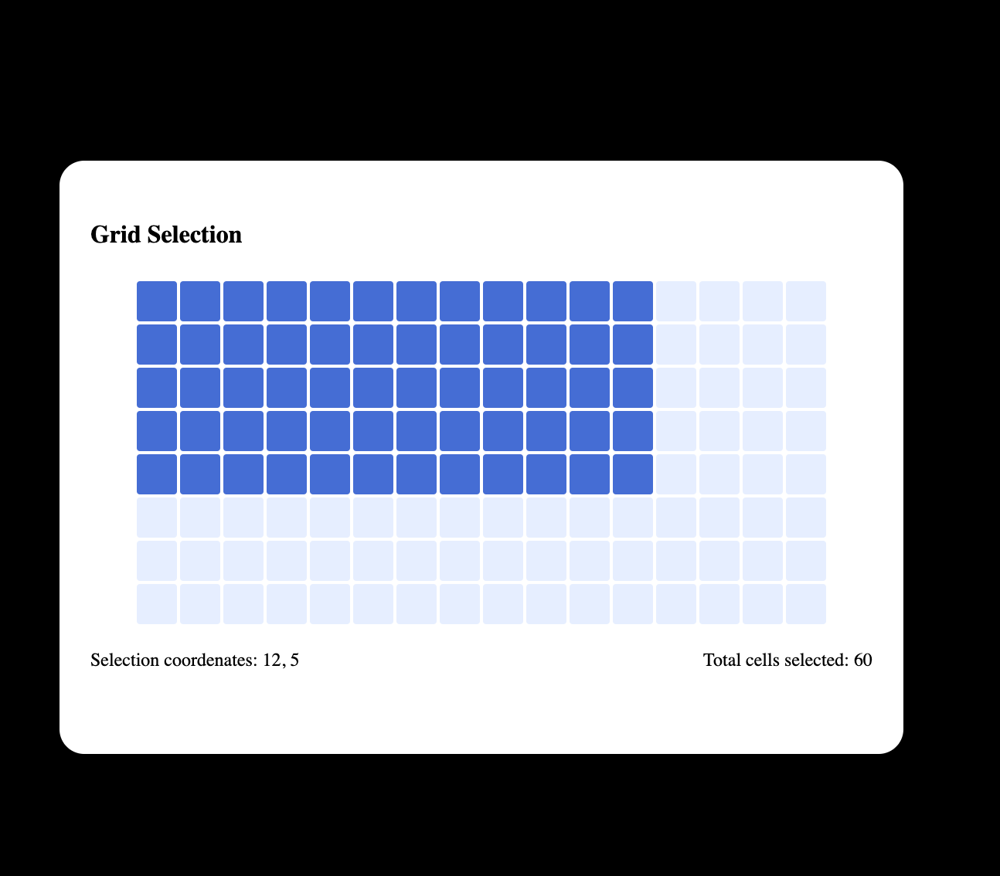
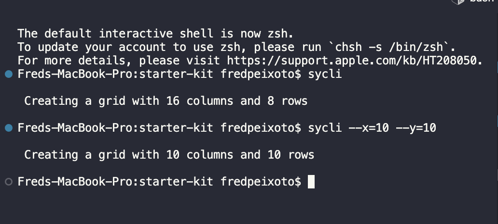

# Symbols Starter Kit
Example dev setup (boilerplate) to use [DOMQL](https://github.com/domql/domql). You can also check live editor [Playground](https://domql.com/playground/).

### Setup

1. Clone the repo
```
git clone git@github.com:symbo-ls/starter-kit.git
```

2. Install scripts
```
yarn
```

3. Run the project
```
yarn start
```



4. Go to sy-cli folder and on this folder execute npm install -g to order access the CLI by any folder. You will need root privilegies
```
npm install -g
```

5. Go to the root project folder and execute the CLI command using `sycli` to create the grid with default parameters, 16 columns and 8 rows.
```
sycli
```

6. To pass parameters execute
```
sycli --x=10 --y=10
```
And it will create a grid 10x10.


